# Parkinson's Disease Progression Prediction

This project focuses on predicting the progression of Parkinson's disease using machine learning techniques. Parkinson's disease is a neurodegenerative disorder that affects movement and can have a significant impact on a person's quality of life. Early prediction of disease progression can help in better management and personalized treatment planning.

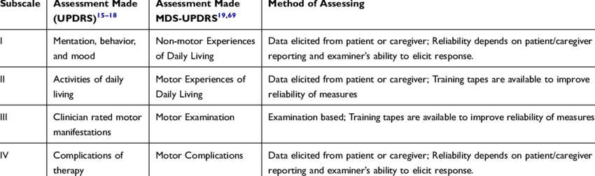

## Project Overview

The goal of this project is to develop a predictive model that can estimate the progression of Parkinson's disease based on various features such as demographic information, clinical assessments, and biomedical measurements. The model will be trained on a labeled dataset containing data from patients at different stages of the disease.

The project involves the following steps:

1. **Data Collection**: Obtain a comprehensive dataset that includes relevant features and target labels for Parkinson's disease progression.

2. **Data Preprocessing**: Perform data cleaning, handling missing values, feature engineering, and scaling to prepare the dataset for machine learning algorithms.

3. **Feature Selection**: Identify the most informative features using techniques such as statistical analysis, correlation analysis, or feature importance from machine learning models.
    Statistical Analysis: We conduct statistical tests such as t-tests, chi-square tests, or ANOVA to determine the statistical significance of each feature in relation to the target variable. Features with high statistical significance are considered more likely to be relevant for prediction.

    Correlation Analysis: We calculate the correlation coefficients (e.g., Pearson's correlation coefficient) between each feature and the target variable. Features with high correlation values, either positive or negative, are likely to have a strong relationship with the progression of Parkinson's disease.

    Feature Importance: For ensemble models such as Random Forest, Gradient Boosting, or XGBoost, we utilize the built-in feature importance measures provided by these models. These measures assess the contribution of each feature in the model's predictive performance.

4. **Model Training**: Apply various machine learning algorithms, such as regression or classification models, to train on the prepared dataset. Experiment with different algorithms and hyperparameter tuning to achieve the best predictive performance.

    ElasticNet Regression: A linear regression model that combines both L1 and L2 regularization to balance between sparsity and model complexity.

    Support Vector Regression (SVR): A regression model based on Support Vector Machines that uses a non-linear kernel function to capture complex relationships in the data.

    Random Forest Regression: An ensemble model that combines multiple decision trees to make predictions, considering a subset of features and using averaging to improve performance.

    Bagging Regression: An ensemble model that creates multiple subsets of the training data and fits a separate model to each subset, reducing variance and improving stability.

    Decision Tree Regression: A non-linear regression model that splits the data based on feature thresholds to create a tree-like structure for prediction.

    K-Nearest Neighbors Regression: A model that predicts the target variable based on the average of the K closest neighbors in the feature space.
    XGBoost Regression: Another gradient boosting library that provides high-performance implementations of gradient boosting algorithms.

    Deep Neural Network: A custom deep neural network model specifically designed for this project, leveraging the power of neural networks for prediction.

    Voting Regression: An ensemble model that combines the predictions of multiple individual regression models to make final predictions.

    And More...

5. **Model Evaluation**: Evaluate the trained models using appropriate evaluation metrics and techniques, such as cross-validation or holdout validation, to assess their performance and generalization ability.
    Evaluation Metrics: We employ appropriate evaluation metrics that reflect the specific goals and requirements of Parkinson's disease progression prediction. Commonly used metrics for regression tasks include:

    
Mean Squared Error (MSE): Measures the average squared difference between the predicted and actual values, giving higher weights to larger errors.

    
Root Mean Squared Error (RMSE): The square root of the MSE, providing a metric in the same scale as the target variable.

    
Mean Absolute Error (MAE): Calculates the average absolute difference between the predicted and actual values, providing a metric in the original scale.

    
R-squared (R^2) Score: Indicates the proportion of variance in the target variable that can be explained by the model, with higher values indicating better fit.

    
Symmetric Mean Absolute Percentage Error (SMAPE): Is an evaluation metric used to measure the accuracy of a forecasting or regression model. It calculates the percentage difference between the predicted and actual values, taking into account the scale of the data.

    Cross-Validation: To ensure robust evaluation, we employ techniques like k-fold cross-validation. This involves dividing the dataset into k equal-sized folds and performing training and evaluation k times, each time using a different fold as the test set and the remaining folds as the training set. Cross-validation helps estimate the model's performance on unseen data and mitigates the impact of data partitioning.

    Visualization: We may visualize the predicted values against the actual values using scatter plots or line plots. This allows us to visually assess the model's ability to capture the underlying patterns and trends in the data.

6. **Prediction**: Utilize the trained model to predict the progression of Parkinson's disease for new, unseen data. This can help in early detection and personalized treatment planning for patients.

## Installation

To run this project locally, follow these steps:

1. Clone the repository: https://github.com/ngocthien2306/Parkinsons-Disease-Progression-Prediction

2. Install the required dependencies by running the following command
    pip install -r requirements.txt

3. Run the project by executing the main ipynb file

## Dataset

The dataset used in this project contains a collection of clinical and biomedical features of patients diagnosed with Parkinson's disease. Each instance in the dataset represents a patient, and the target variable indicates the disease progression score.

You can find the dataset at https://www.kaggle.com/competitions/amp-parkinsons-disease-progression-prediction/data or https://drive.google.com/drive/folders/1E5avHXDpbz2h_i4jM1nn-6o7hYJOXbw-?usp=sharing. Download the dataset and place it in the `data/` directory before running the project.

## Results

Provide an overview of the results obtained from the trained model. Include key performance metrics such as accuracy, precision, recall, or any domain-specific evaluation metrics that are relevant to Parkinson's disease progression prediction.

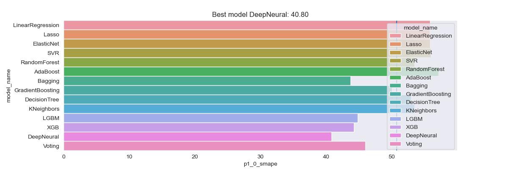
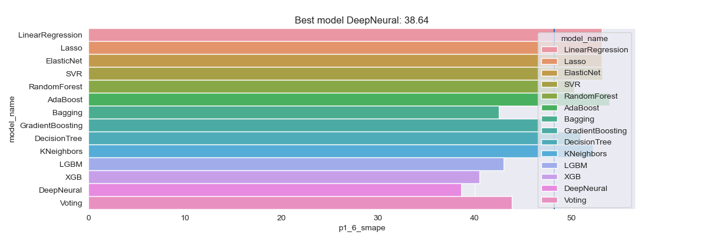
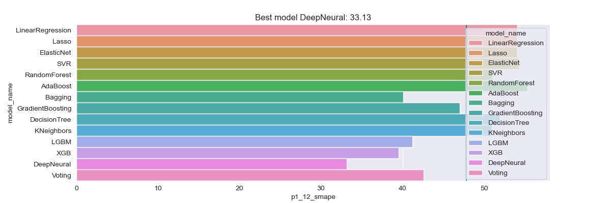
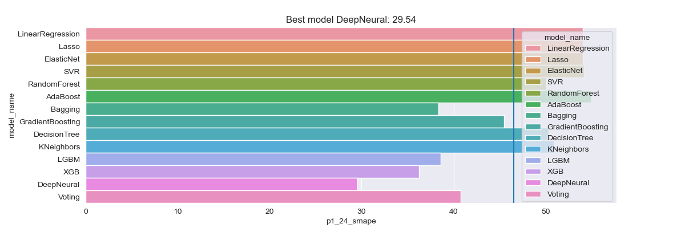

#### Fine Tune Result
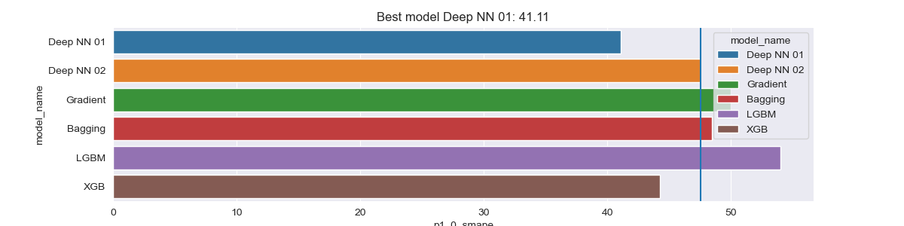
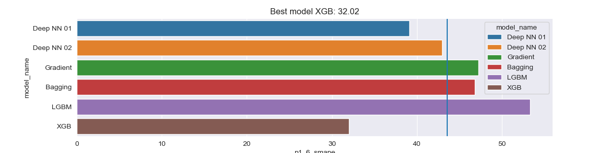
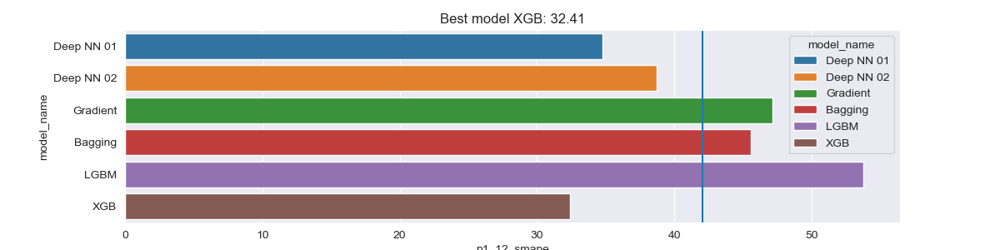
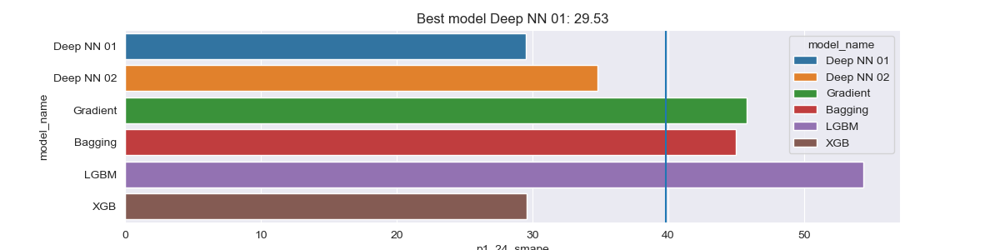

#### Mean meansure result

Symmetric Mean Absolute Percentage Error (SMAPE)

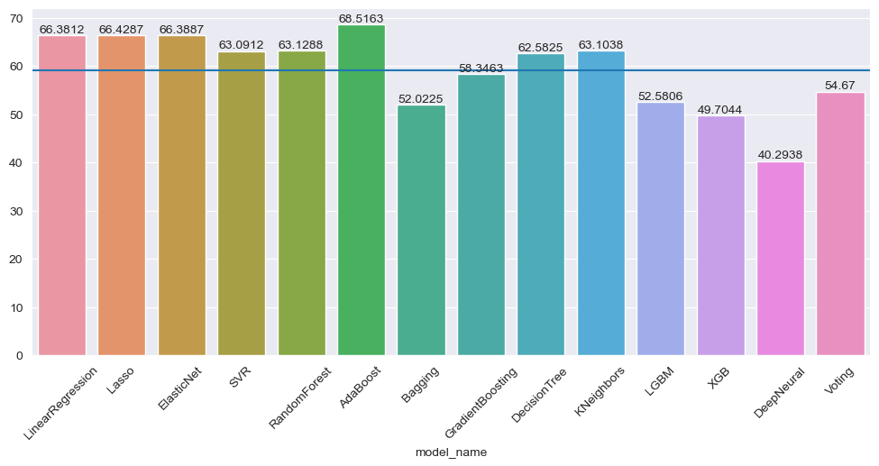

R-squared (R^2) Score

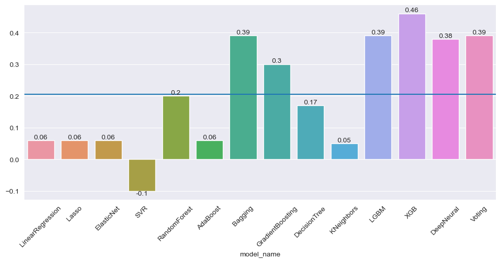

#### Time training
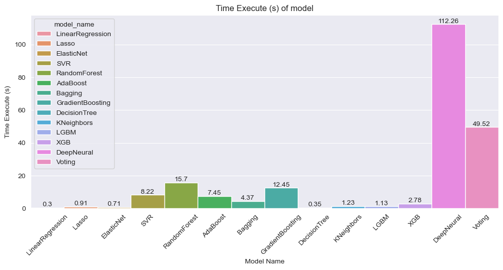

## Contributing

Contributions to this project are welcome. If you have any ideas or suggestions for improvements, please open an issue or submit a pull request.

## License

[MIT License](LICENSE)

## Contact

For any questions or inquiries, please contact thiennn.ds23@outlook.com

